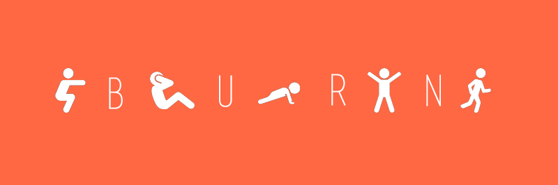

# PROG 01: Crunch Time

App that converts number of minutes/reps of activity into calories and equivalent of minutes/reps in other activities.

## Authors

Maya Angelica Hernandez ([mayaah@berkeley.edu](mailto:mayaah@berkeley.edu))

## Demo Video

See [Burn] (https://youtu.be/iqgnK0gNT_M)

## Screenshots

## Acknowledgments

* Hat tip to anyone who's code was used. Shout out to Google image search for icons.
* Any other support

